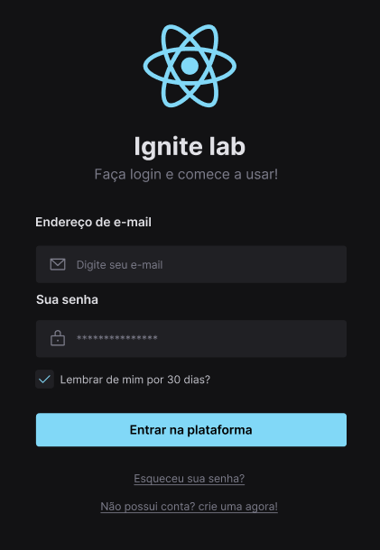

# ReactJS + TypeScript + StoryBook

## Ignite Lab 03

RocketSeat Ignite Lab 03 StoryBook made using ReactJS, TailwindCSS, PostCSS, Radix and Jest.

You can find the figma layout [here](https://www.figma.com/file/XdVQjN86SC98qVSz7Xtqkl/Ignite-Lab-Design-System)

This storybook has the object to padronize components, pages and UI elements to obtain a quality control when you're building a large view, for example, a complex form.

